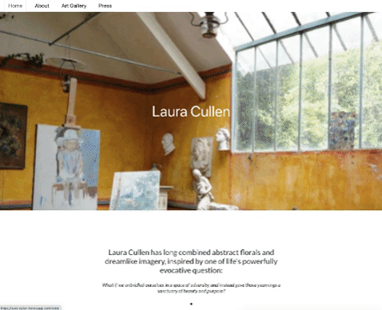

# Laura-Cullen
  


<a href="https://laura-cullen.herokuapp.com/">Click here to see it in action.</a>

## Table of Contents
* [Description](#description)
* [Installation](#installation)
* [Usage](#usage)
* [License](#license)
* [Contributions](#contributions)
* [Tests](#tests)
* [Questions](#questions)

## Description 
*Overview of this project:* <br>
Laura Cullen is a modern artist who is always making new work and presenting in exhibits with her existing collection. 
* The website build will include a manager portal that she can login to update the blog section and retrieve email sign ups. 
* Stores emails and blogs using MongoDB. 
* Showcases a polished UI with parallax scroll features to give it an artsy vibe.


## Installation
*Steps required to install project and get the development environment established:*
* Simply use the npm install command in your terminal to install all necessary packages to launch Laura's website application!

```bash
npm install
npm run seed
npm start
```

## Usage
*Instructions and examples for use:* 
* There are six pages in total that make up Laura's website. For users there are four main pages - Home, About, Gallery and Press. When Laura logs in through her manager portal she has access to two additional pages - blogs, and newsletter.  
1. Home page:
    1. The home page features images of Laura's studio and a poem written by Laura at the top
    2. Recent work and exhibits as you scroll down the page. 
2. About page:
    1. The about page gives a summary of Laura's history and the type of work she creates. 
3. Gallery page:
    1. This is where users can veiw Laura's different collections. 
4. Press page:
    1. Features write ups from press outlets as well as blog posts that Laura can enter herself. 
5. Blogs page:
     1. There is an entry form on this page that allowes Laura to enter Title, author, image, and description for blogs and press.
     2. The information she enters will be updated into the MongoDB data base and will be displayed on the press page for users to see.
6. Newsletter page:
     1. When someone signs up on the home page their email will go into a MongoDB database
     2. These emails become visible on the backend of the site where Laura can get grab them to send out her newsletter.




## License 
* Built under the MIT licence.

## Credits
* Built & designed by Lili Cohen, Kat Nguyen, Tomara Petty, Ellis Delgado and Markos Escalante

## Test
* No tests required. 

## Questions?
<p float="left">


</p>
<br>

#### If you have any questions or want to make a contribution please reach out to us here:
<br>

**GitHub:**  
* @lilipcohen 
* @markos-escalante 
* @tomarapetty
* @katnguyenn 
* @ellisd16 <br>

**Email:** 
* nguyenkat01@yahoo.com
* tomararuth@gmail.com 
* lili.cohen.tv@gmail.com 
* escalante.markos18@gmail.com <br>

**LinkedIn:** 
* Tomara: https://www.linkedin.com/in/tomara-petty/ 
* Lili: http://www.linkedin.com/in/lili-cohen-78a93a1b3 
* Kat: https://www.linkedin.com/in/katherine-nguyen-205a7b13a/ 
* Markos: https://www.linkedin.com/feed/
* Ellis: https://github.com/Ellisd16

